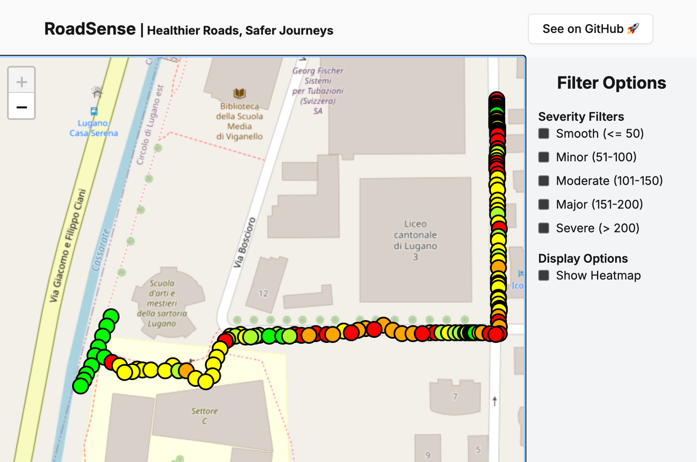
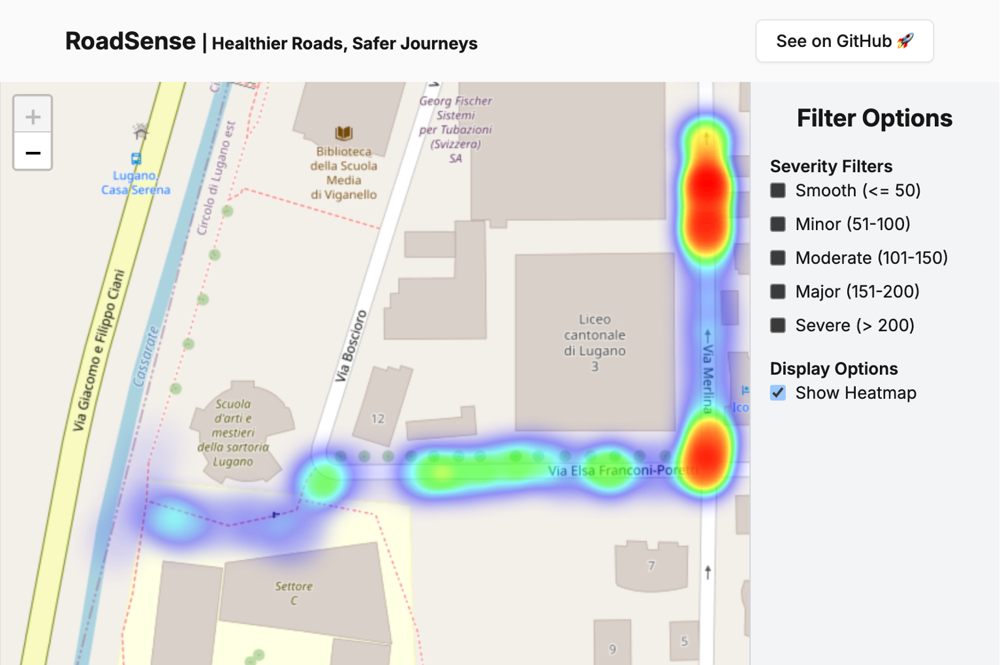
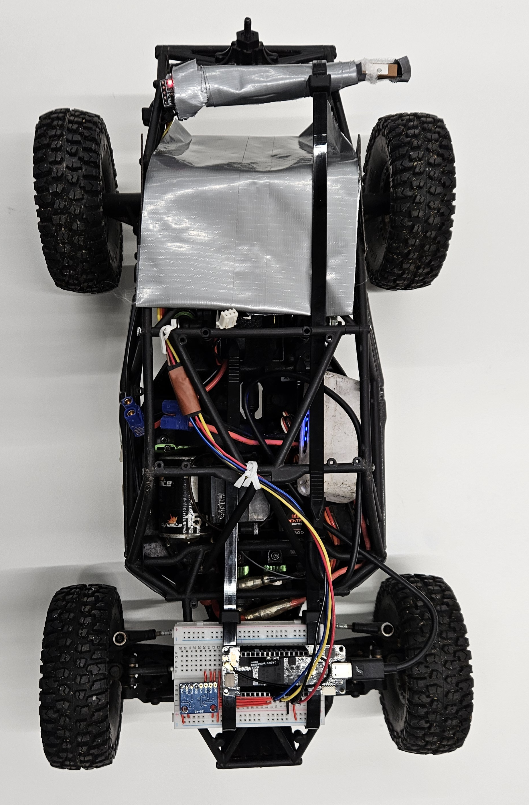
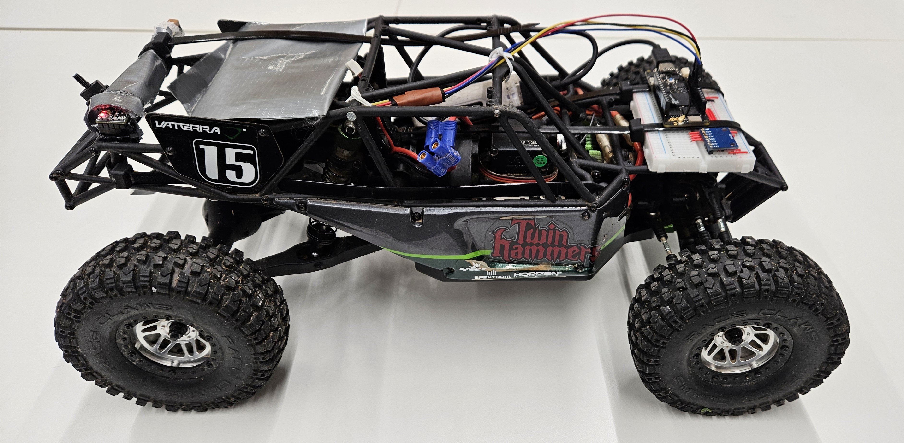
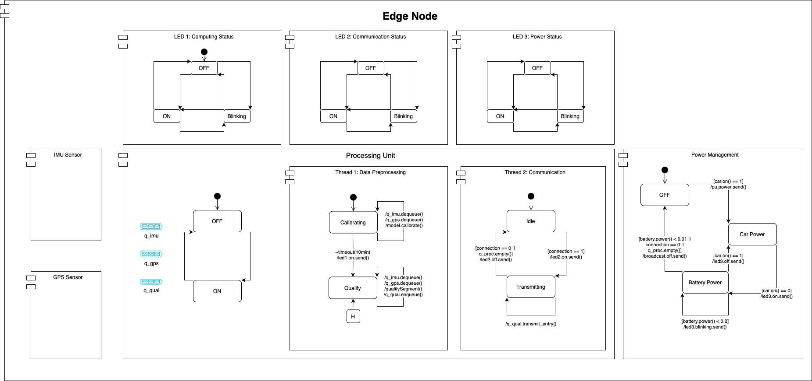
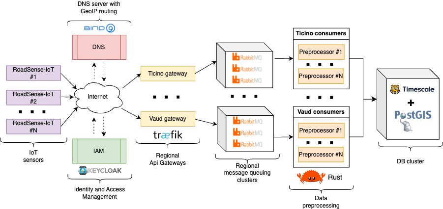
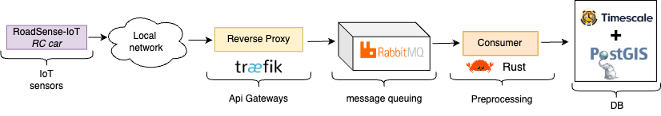
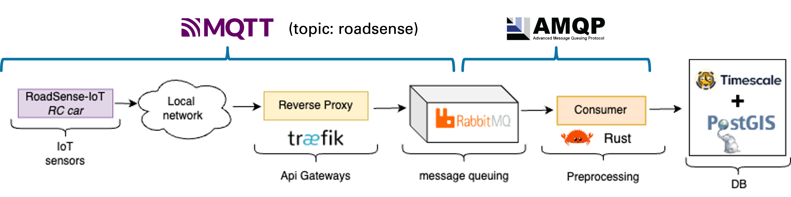

# 🚗 RoadSense: Healtier Roads, Safer Rides

The **RoadSense** project represents an IoT-powered system for
detecting and mapping road anomalies, such as potholes and uneven
surfaces. By equipping multiple vehicles with sensor nodes, the system
will gather and analyze road vibration data to generate an interactive,
detailed heatmap of road conditions. This data will be instrumental in
optimizing road maintenance, enhancing driver safety, and providing
real-time hazard alerts.

## RoadSense in action

<center>
  
  <figcaption>Point Quality Data Visualization</figcaption>
</center>

<center style="margin-bottom: 10px">
  
  <figcaption>Heatmap Visualization (red = severe road conditions)</figcaption>
</center>

## Prototype Car

|  |  |
| :---------------------------------------------------------------: | :-----------------------------------------------------------------: |
|                    _Prototype Car (top view)_                     |                     _Prototype Car (side view)_                     |

### Hardware Components

1. **Microcontroller**:

   **Arduino Portenta H7** with built-in Wi-Fi capability and RTOS
   support. Enables usage of threads for sensor data collection and
   transmission.

2. **IMU Sensor**:

   **GY-521** with MPU6050 6DOF (3-Axis Gyro and 3-Axis
   Accelerometer). While currently only the z-axis acceleration is used, the sensor
   provides additional data which can be used for future work to
   improve the road state qualification model.

3. **GPS Module**:

   **DFRobot GPS + BDS BeiDou** with output of position and speed.\
   We were able to fix connectivity by integrating EMF shielding. As
   the transmitted speed data was faulty, we had to make use of a
   fallback solution by approximating each segment through a fixed time
   of 3 seconds.

4. **EMF Shielding**:

   **DIY** using aluminum foil to shield the GPS module from
   electromagnetic interference.

Detailed information on the pin connections for the sensors with the Arduino Portenta H7 can be found in the following table.

**Sensor** **Portenta H7** **Description**

---

| **Module**      | **Pin** | **Portenta H7 Pin** | **Description**                               |
| --------------- | ------- | ------------------- | --------------------------------------------- |
| **GY-521**      | VCC     | 3.3V                | Power supply (3.3V)                           |
|                 | GND     | GND                 | Ground                                        |
|                 | SDA     | SDA (Pin 11)        | I2C Data line (SDA)                           |
|                 | SCL     | SCL (Pin 12)        | I2C Clock line (SCL)                          |
| **DFRobot GPS** | VCC     | 3.3V                | Power supply (3.3V)                           |
|                 | GND     | GND                 | Ground                                        |
|                 | TX      | RX (Pin 13)         | Serial data transmit line (TX from GPS to RX) |
|                 | RX      | TX (Pin 14)         | Serial data receive line (RX from GPS to TX)  |

## Overview

The **RoadSense** system consists of the following components:

- **Sensor Nodes**: IoT devices installed in vehicles, responsible for
  collecting inertial data using an Inertial Measurement Unit (IMU)
  sensor and location data via a GPS module. These nodes pre-process
  data to compute a qualifier for localized road states, reducing the
  volume of data sent to the central infrastructure.

- **Data Aggregation and Processing System**: A centralized backend
  platform responsible for receiving, aggregating, and analyzing data
  from multiple sensor nodes. This system generates detailed road
  quality insights and produces interactive heatmaps for
  visualization. It also includes mechanisms for detecting anomalies
  and triggering alerts.

- **Control Logic**: Defines the operational behavior of the IoT
  devices, including protocols for data collection, processing, and
  communication with the central system.

- **User Interface**: An interactive web application that enables
  stakeholders to visualize road conditions, explore heatmaps, and
  manage alerts effectively.

## Sensor Nodes

<center>
  
  <figcaption>RT-UML of a Sensor Node</figcaption>
</center>

### Main Design Aspects

1. **Cost Restriction per node**:  100 CHF
   Given the large number of vehicles that will host sensor nodes, the
   cost per node must remain as low as possible. To achieve this, each
   vehicle will have a single sensor node/package installed to minimize
   installation and part costs. The qualification model is designed to
   be computationally efficient to minimize the cost of the
   microcontroller. Wifi connectability is chosen to minimize the cost
   of the communication module.

2. **Quantification of Road State**:
   The sensor node will be ideally positioned centrally in the vehicle,
   above one of the axles, and securely mounted to the chassis to
   reduce measurement errors. The road state will be quantified on a
   scale from 0 (very good) to 244 (very poor), with 255 reserved for
   hazardous conditions.

3. **Qualification Model**:

   $$
   \text{RoadQuality}_i =  \left\lfloor \frac{\max(\Delta a_{z,t}) - \Delta a_{z,\min}}{\Delta a_{z,\max} - \Delta a_{z,\min}} \right\rfloor  \cdot 255 \quad \text{where} \quad  t \in \text{RoadSegment}_i
   $$

   This model is based on the assumption that the maximum acceleration
   in z-axis is proportional to the road quality. By calculating the
   acceleration difference between the current and the previous time
   step, the model is unaffected by the vehicle's orientation and
   acceleration. $\Delta a_{z,\text{min}}$ and
   $\Delta a_{z,\text{max}}$ are determined during the calibration
   phase and symbolize the minimum and maximum acceleration difference
   occurring during possible driving conditions. This makes the model
   adaptable to different vehicles and driving conditions.

   Future iterations will adapt a simulation based approach described
   in the following:

   A simple linear Mass-Spring-Damper Model is chosen to model the cars
   factor on the transduced shocks. (While keeping computational effort
   low.) A first calibration phase coupled to a initial parameter set
   aims to fit Mass-Spring-Damper Model parameters. Measured data will
   be fit to quantified values during calibration phase. Further
   physical quatities other than z-axis acceleration have to be
   considered to decouple driving induced accelerations from the road
   state.

4. **High Polling Rate for IMU Measurements**:

   Road-induced shocks are brief and their period and amplitude are
   proportional to vehicle speed. The IMU's polling rate will be
   configured to ensure reliable readings for typical driving speeds.
   Currently the acceleration is measured every 3ms, acchieving a road
   resolution of 2.5cm at 30 km/h which is the assumed avrage speed in
   urban areas.

5. **Sensing of physical quantities**: The system will measure multiple
   physical quantities to ensure accurate road state assessments:

   1. **Acceleration in z-Axis** to determine road state and potholes.

   2. **Acceleration in x,y-Axis and rotational acceleration** to
      minimize errors induced from driving scenarios. (Possible part
      of future work)

   3. **Driving Velocity** to approximate relative distance through
      integration needed for velocity indipendent Segmentation of
      QualityMeasures.
      (Future Work: to couple shock amplitudes to velocity through
      Spring-Damper Model).

   4. **Geographical Position** to reference qualification to current
      position.

6. **Data Transmission at Established Gatepoints**:

   1. **Data Format**: Each data package will include the following
      information encoded as a JSON object:

      ```
      (Node ID (2 Bytes)) |
       Position (2 x 8 Bytes (Double-Precision Float)) | Road Quality (1 Byte) | Unix Timestamp (4 Bytes)
      ```

      For example, the following snippet represents a valid data
      sample in JSON format:

      ```json
      {
        "lat": 46.19313,
        "lon": 6.80421,
        "timestamp": 1734478933,
        "bumpiness": 50,
        "device_id": "USI-Car-1""
      }
      ```

   2. **Local Preprocessing**: The node will preprocess and store
      position-quality tuples locally.

   3. **Gatepoint Connectivity**: The node will automatically
      establish a connection at predefined gatepoints to transmit new
      data.

   4. **Data Protocol**: Data packages will be transmitted in MQTT
      format to a RabbitMQ server.

## System Architecture

The **RoadSense** consists of multiple IoT devices installed in
vehicles, communicating with a central server designed to be highly
scalable to handle data from thousands of devices. In this section we
will describe all meaningful components of the system, focusing on the
IoT data pipeline and the client-server architecture.

### IoT Data Pipeline

The data pipeline has been designed with scalability in mind, allowing
for efficient data collection, processing, and data analysis from
multiple (potentially thousands) concurrent IoT devices. The following
diagram illustrates the pipeline steps, from data ingestion to the
storage of processed data.

<center style="margin-bottom: 10px">
  
  <figcaption>IoT Data Pipeline Architecture</figcaption>
</center>

The pipeline consists of the following components:

1. **Data ingestion**: IoT devices collect vibration, GPS, and other
   relevant data points. When the vehicle reaches an access point, the
   data will be transmitted to the server. Each device will be able to
   connect to different Wi-Fi networks, allowing for data transmission
   in different locations. This may include public Wi-Fi networks,
   cellular data, or a dedicated network infrastructure.

2. **Authentication and security**: In the original idea of the project
   each device is authenticated before data transmission to ensure data
   integrity and prevent unauthorized access. For this purpose, was
   decided to use [Keycloak](https://www.keycloak.org/) for identity
   and access management. Unfortunately, this feature was not
   implemented in the presented prototype in order to focus on the core
   functionality of the system.

3. **Geographical distribution**: The server leverages DNS-based load
   balancing to distribute incoming data across regional gateways for
   efficient processing. We have chosen to use
   [BIND9](https://www.isc.org/bind/) for DNS-based load balancing
   along with [GeoIP](https://www.maxmind.com/en/geoip2-databases) for
   geolocation. Each regional gateway will be responsible for routing
   the user requests to the regional message queuing system. For this
   purpose, we will use [Traefik](https://traefik.io/) as the reverse
   proxy. Unfortunately, also this feature was not implemented in the
   prototype as it would introduce additional complexity to the system.
   However, this feature is essential for the scalability of the system
   as it allows for efficient data processing across multiple regions.

4. **Message queues**: Each gateway node processes incoming data and
   forwards it to a regional queuing system to allow for parallel
   processing. After evaluating multiple options, we decided to use
   [RabbitMQ](https://www.rabbitmq.com/) as the message queue system.
   To ensure high availability, we will deploy RabbitMQ in a cluster
   configuration (refer to the [RabbitMQ Clustering
   Guide](https://www.rabbitmq.com/clustering.html)). For the prototype
   we avoided the creation of a RabbitMQ cluster, and was used a single
   instance of RabbitMQ. This feature is still of interest for the
   scalability of the system.

5. **Data Consumers and Preprocessing**: Each region is served by a set
   of consumer microservices that retrieve incoming data from the
   RabbitMQ clusters, perform data validation, and execute map matching
   to process and align the data with geographical coordinates.

   During the initial project specifications, [Go](https://golang.org/)
   was selected as the primary language for these microservices.
   However, the prototype implementation utilized
   [Rust](https://rust-lang.org/) instead. This decision was driven by
   the opportunity to explore Rust's performance and safety features.
   The microservices were designed to be lightweight, efficient, and
   resilient against failures.

6. **Data storage**: Processed data is stored in a scalable database
   system that can handle high volumes of data. Since we are dealing
   with both date-time and geospatial data, we chose to use
   [TimescaleDB](https://www.timescale.com/) as the database system
   with the [PostGIS](https://postgis.net/) extension to support
   geospatial queries. PostGIS was used to store and query collected
   samples

_Note:_ Although not implemented in the current prototype, most of the
services/microservices described above could be containerized (if not
already) using technologies like Docker and managed in a production
environment using [Kubernetes](https://kubernetes.io/) for scalability
and orchestration.

### Client-Server interaction

The **RoadSense** system employs a client-server architecture designed
to efficiently deliver real-time road condition data. The client is a
web-based application that visualizes road condition samples on an
interactive map. These samples are fetched from a custom API
microservice, which only returns data points within the map's current
bounding box, leveraging **PostGIS** for spatial queries to optimize
performance and minimize data transfer. This ensures scalability and
efficient handling of large datasets, as the system can support millions
of samples without overwhelming either the client or the server. The
following diagram illustrates the client-server interaction:

<center style="margin-bottom: 10px">
 for
database interaction. It provides a read-only interface, returning road
condition samples in `JSON` format based on client requests. Data
insertion is handled by separate consumers processing messages from
**RabbitMQ**. The architecture enables efficient data processing,
retrieval, and real-time visualization while maintaining scalability and
performance.

# System Implementation

This chapter details the implementation of the **RoadSense** system,
focusing on the practical realization of its architecture and
components. The system integrates various technologies to ensure
reliable data collection, processing, and visualization for monitoring
road conditions.

The implementation covers three main areas: the IoT sensor nodes
deployed in vehicles for data acquisition, the backend infrastructure
responsible for data aggregation and analysis, and the client-side
application used for data visualization and user interaction. Each
component is designed to optimize performance, scalability, and
usability.

The IoT sensor nodes preprocess data locally to reduce transmission
overhead while ensuring accurate representation of road states. The
backend, built using a microservice-based approach, processes incoming
data, stores it efficiently, and provides APIs for real-time access to
relevant datasets. The client application uses these APIs to present
road condition data interactively on a map, supporting features such as
filtering, heatmaps, and severity-based color coding.

This chapter provides detailed insights into the implementation of these
components, explaining the choices of technologies and methodologies
employed to achieve the desired functionality and performance of the
system.

## Prototype Embedded Firmware

In this section, we provide an overview of the core components and
implementation details of the prototype embedded firmware developed for
the sensor node. The firmware orchestrates sensor data acquisition, road
quality analysis, and reliable data transmission to an external system.
The following subsections summarize the primary files and their
responsibilities:

- **Mainfile (roadsense-embedded.ino):** Initializes the system, sets
  up multithreaded operations, and manages the data flow between
  sensor acquisition and network transmission.

- **roadqualifier.h:** Contains the logic for measuring, calibrating,
  and quantifying road segment quality using specified sensors, along
  with persistent calibration-data handling. It also provides
  simulated sensor modes for debugging and testing.

- **RabbitMQClient.h:** Handles WiFi connectivity and MQTT-based
  communication, enabling the sending of computed road quality metrics
  to a RabbitMQ server.

By clearly defining these components, the firmware maintains a modular
structure, simplifying development, testing, and future enhancements.

### Mainfile (roadsense-embedded.ino)

The main Arduino `roadsense-embedded.ino` file serves as the central
entry point for the embedded firmware running on the sensor node. Its
primary tasks involve initializing system components, orchestrating two
concurrent threads for road data acquisition and transmission, and
managing communication buffers.

- **Initialization and Setup:** At startup, the main file initializes
  serial communication for debugging. It then sets up the
  `RoadQualifier` instance, which prepares sensor input (e.g., IMU and
  GPS readings) for analyzing road quality. If initialization fails,
  the system reports this via serial output (only for debugging). LED
  indicators will be used to signal system readiness or errors in
  future iterations.

- **Multithreading using Mbed OS:** Leveraging Mbed OS RTOS features,
  the firmware runs two threads concurrently:

  1. _Road Segmentation Thread_: Periodically calls
     `roadQualifier.qualifySegment()` to compute the quality of a
     road segment. Upon success, it stores the resulting
     `SegmentQuality` record into a thread-safe circular buffer.

  2. _Data Transmission Thread_: Establishes and maintains a WiFi
     connection, then continuously reads from the circular buffer to
     transmit data using a `RabbitMQClient`. If no data is available,
     it waits until new records arrive. The thread is able to handle
     connection failures and re-establish the connection when
     available.

- **Circular Buffer for Data Storage:**
  A custom circular buffer, protected by a mutex, ensures safe
  concurrent access from both threads. If the buffer is full, the
  oldest entry is overwritten, preventing blocking conditions and
  ensuring efficient memory usage.

- **Data Transmission via RabbitMQ:**
  Once connected to WiFi, the data transmission thread publishes
  buffered `SegmentQuality` records to an external system through the
  `rabbitMQClient`. This design decouples data acquisition from
  network-related issues, allowing both to operate independently.

- **Watchdog and Timing:**
  Although not currently used, the code includes a watchdog timer as
  we planned to use it increase errors related to one of the threads.
  Such safety mechanisms will be implemented in future iterations. The
  system also includes a timing mechanism to ensure that the road
  segment qualification and data transmission threads operate at the
  desired intervals.

- **Main Loop:**
  The `loop()` function remains empty, as the system relies on RTOS
  threads for ongoing tasks. All main logic thus resides in separate
  threads defined in the setup phase.

### roadqualifier.h

The `roadqualifier.h` file encapsulates the logic and data structures
required to process road quality measurements from connected sensors,
manage calibration and data persistence, and ensure system readiness.
This file defines the `RoadQualifier` class, which serves as the core of
the road quality analysis functionality.

- **Sensor Abstraction and Dummy Modes:** The code supports both
  actual hardware operation and dummy sensor modes for testing without
  physical IMU or GPS devices. Conditional compilation flags (e.g.,
  `DUMMY_MPU` and `DUMMY_GPS`) select between real and simulated
  sensor inputs. This approach allows for development and debugging of
  other modules without actual available sensors.

- **Road Segment Qualification:** The `RoadQualifier` class provides a
  `qualifySegment()` method to measure a predefined road segment's
  quality. It uses acceleration data (from the MPU6050 or dummy
  equivalent) and position/speed data (from a GPS module or dummy
  object) to compute a `SegmentQuality` metric. If a valid segment is
  detected, it returns a quantized quality value mapped into a byte
  range. If the segment is invalid (e.g., due to missing GPS data
  within the first 10% of the segment), the method returns `false`.

- **Calibration Handling and Flash Memory:** The file includes
  routines for:

  - _Calibration_: Acquiring accelerometer data over a specified
    timeframe to determine minimum and maximum values, ensuring that
    subsequent measurements are interpreted correctly.

  - _Persistent Storage_: Using Mbed's `FlashIAPBlockDevice` and
    related helpers (`FlashIAPLimits.h`) to store and retrieve
    calibration parameters (e.g., minimum and maximum acceleration
    differences) in non-volatile flash memory.

  - _Deletion of Calibration Data_: Providing a function
    `deleteCalibrationFromFlash()` to erase previously stored
    calibration information, enabling reset or re-calibration
    scenarios.

- **Quantification and Mapping:** A dedicated `quantifyToByte()`
  function maps computed acceleration differences into a 0--255 byte
  range based on the caputred calibration data. This allows for easy
  interpretation, efficient storage and transmission of road quality
  metrics.

- **Initial Setup and Readiness Checks:** The `begin()` method
  initializes sensors, loads or creates calibration data, and ensures
  a stable GPS fix before considering the system ready. The
  `isReady()` method provides a quick way to confirm that the
  `RoadQualifier` is fully operational.

- **GPS and IMU Integration:** Functions such as
  `waitForValidLocation()` and `waitForValidSpeed()` ensure that the
  system obtains reliable, fresh data from the GPS before proceeding.
  The IMU (or dummy MPU) data is read at each iteration, feeding the
  computation that identifies peak acceleration differences along the
  measured road segment.

### RabbitMQClient.h

The `RabbitMQClient.h` file manages the communication between the sensor
node and an external RabbitMQ server over MQTT. It encapsulates WiFi
connectivity handling, MQTT client operations, and the formatting and
publishing of road segment data into a consistent interface.

- **WiFi Connectivity Management:** The class attempts to connect to
  one of several predefined WiFi networks. It continually checks WiFi
  status and provides a method `isConnectedWiFi()` to confirm a
  successful connection. By iterating through a list of credentials,
  the code increases the likelihood of establishing a network
  connection in various deployment environments.

- **MQTT Integration for RabbitMQ:** The `RabbitMQClient` uses the
  `PubSubClient` library to communicate over the MQTT protocol. It
  sets up the MQTT server (RabbitMQ host, port, user, and password)
  and ensures a persistent connection. The `connect()` method and the
  internal `ensureConnected()` helper function handle reconnection
  logic and error reporting.

- **Error Handling:** In case of connection failures or publishing
  errors, the class stores the MQTT state code, accessible via
  `getErrorCode()`. This mechanism aids in debugging and understanding
  the cause of communication issues.

- **Publishing Data and Callbacks:** To send road segment quality
  data, the class provides:

  - _`publishSegmentQuality()`_: Converts a `SegmentQuality` struct
    into a JSON-formatted message and publishes it to a designated
    MQTT topic.

  - _`sendDataCallback()`_: A method suitable for periodic or
    callback-driven operations, connecting to the RabbitMQ server
    (if not connected) and publishing freshly acquired segment data.

- **Integration with the Firmware:** By abstracting away the details
  of WiFi and MQTT connections, `RabbitMQClient` allows other parts of
  the firmware---such as the road qualifier threads---to focus solely
  on data acquisition and retrieval. The communication logic remains
  modular, enabling future changes to the network stack or message
  format without altering the core road quality logic.

## Prototype data processing pipeline

The prototype implementation of the data processing pipeline is a
simplified version of the architecture described in
[1.3.1](#subsec:iot_data_pipeline){reference-type="ref+label"
reference="subsec:iot_data_pipeline"}. Certain components such as
**Keycloak** for authentication, geographical-based routing, and running
services in a cluster have been omitted. These decisions were made to
streamline development and focus on the core functionality of the
system, deferring concerns like scalability and advanced security to
future iterations.

The core concept remains consistent with the original design: a
**queuing server** is placed behind a **reverse proxy** (using
**Traefik**) to provide enhanced security and additional features such
as load balancing and request routing. A **consumer** service then pulls
data from the queue, performs preprocessing, and stores the processed
data in a database. This approach enables modularity and ensures the
data is prepared for subsequent analysis and visualization.

While the current implementation lacks certain advanced features, it
retains the essential components to validate the core functionality.
This includes the ability to handle incoming IoT data, preprocess it,
and store it in a format optimized for the system's use cases. The
pipeline serves as a foundation for future iterations, where
scalability, geographical routing, and authentication mechanisms can be
incorporated.

<center style="margin-bottom: 10px">
  
  <figcaption>Prototype Data Processing Pipeline Architecture</figcaption>
</center>

The communication between the IoT device and the RabbitMQ service is
done using the MQTT protocol, while the consumer service uses AMQP to
retrieve messages from the queue. This was done as MQTT is a lightweight
protocol designed for IoT devices, making it suitable for transmitting
sensor data. AMQP, on the other hand, is a robust protocol that provides
additional features such as message acknowledgments and routing. The
following diagram illustrated the flow of data through the prototype
pipeline:

<center style="backgroud-color: white">
  
</center>
<center style="margin-bottom: 10px">
  <figcaption>Prototype Data Processing Pipeline with Annotations</figcaption>
</center>

This simplified implementation allows for faster prototyping and
development while maintaining a clear path for future enhancements to
address scalability and security concerns.

## Web Application Prototype

The **RoadSense** web application prototype serves as the primary
interface for visualizing and interacting with road condition data. It
is designed to demonstrate core functionality and validate the
effectiveness of the system while prioritizing simplicity and
performance over scalability in this phase.

The web application is implemented using the following modern
technologies:

- [React.js](https://reactjs.org/): A JavaScript library for building
  user interfaces.

- [Remix](https://remix.run/): A full-stack web framework built on
  React for modern web apps.

- [TypeScript](https://www.typescriptlang.org/): A strongly typed
  programming language that builds on JavaScript.

- [React Leaflet](https://react-leaflet.js.org/): A library for
  integrating Leaflet maps with React.

- [leaflet.heat](https://github.com/Leaflet/Leaflet.heat): A plugin
  for adding heatmap layers to Leaflet maps.

- [shadcn/ui](https://ui.shadcn.dev/): A collection of customizable
  components for modern UIs.

The map visualization displays road condition samples retrieved from the
backend and presents them color-coded based on severity. The severity
levels are categorized as follows:

- **Smooth (light blue)**: Road quality score between 0 and 50.

- **Minor (green)**: Road quality score between 51 and 100.

- **Moderate (yellow)**: Road quality score between 101 and 150.

- **Major (orange)**: Road quality score between 151 and 200.

- **Severe (dark red)**: Road quality score between 201 and 250.

Users can filter samples by severity to focus on specific road
conditions and toggle between a heatmap view and individual data points
for a more detailed analysis.

To optimize data transfer, the application uses **PostGIS** for spatial
queries, fetching only the samples visible within the map's current
bounding box. This approach minimizes bandwidth usage and enhances
performance, ensuring the system remains responsive even with large
datasets.

The backend interaction is handled through a custom API built with
**Rust**, leveraging the **Actix** framework for web services and
**Diesel** for database operations. Refer to
[1.3.2](#subsec:client_server_interaction){reference-type="ref+label"
reference="subsec:client_server_interaction"} for more details on the
client-server architecture. To optimize data transfer and minimize
latency, the API returns road condition samples in `JSON` format based
on the client map bounds.

The following screenshots illustrate the web application prototype:

<center>
  
  <figcaption>Point Quality Data Visualization</figcaption>
</center>

<center style="margin-bottom: 10px">
  
  <figcaption>Heatmap Visualization (red = severe road conditions)</figcaption>
</center>

This prototype showcases the core functionality of the **RoadSense**
system, providing a foundation for future iterations that will
incorporate advanced features such as user authentication,
geographical-based routing, and deployment in a containerized, clustered
environment.

## Results

The **RoadSense** system was successfully implemented and tested in a
core configuration, demonstrating the feasibility of collecting and
analyzing road quality data using IoT devices. The system consists of
three main components: the sensor node, the data processing pipeline,
and the web application. Each component plays a crucial role in the
system's operation and contributes to the overall goal of improving road
quality monitoring.

The sensor node prototype was developed using an Arduino-based
microcontroller, an IMU sensor, and a GPS module. The node collects
acceleration and location data, processes it to compute road quality
metrics, and transmits the results to the central system. The sensor
node firmware was designed to operate in a multithreaded environment,
with separate threads for data acquisition and transmission. The
firmware includes mechanisms for handling sensor data, road quality
analysis, and network communication. The sensor node successfully
transmitted road quality data to the central system, demonstrating its
ability to collect and process data in real-time.

The data processing pipeline was implemented using a RabbitMQ message
broker, a MongoDB database, and a Node.js server. The pipeline receives
road quality data from sensor nodes, stores it in a database, and
processes it to generate heatmaps and anomaly alerts. The pipeline was
designed to be scalable and fault-tolerant, with support for dynamic
scaling and error handling. The pipeline successfully processed road
quality data from a sensor node, generating a heatmap and alerts based
on the collected data.

The web application provides a user-friendly interface for visualizing
road conditions, exploring heatmaps, and managing alerts. The
application allows users to view road quality data in real-time and
filter data for specific interests. The application was designed to be
responsive and interactive, with support for multiple user roles and
access levels. The web application successfully displayed road quality
data from the central system, enabling users to monitor road conditions
and take appropriate actions.

## Known problems

The current implementation of the **RoadSense** system, while
functional, presents several limitations and areas for improvement:

- **Sensor Node:** The sensor node prototype lacks a robust enclosure
  and mounting mechanism, which can lead to sensor misalignment and
  inaccurate data collection. Additionally, the GPS module's speed
  data is unreliable, requiring a fallback solution to approximate
  road segments.

- **Road Quality Model:** The current road quality model is simplistic
  and relies solely on z-axis acceleration data. Future iterations
  should incorporate additional sensor data and a more sophisticated
  model to improve accuracy.

- **Data Transmission:** The data transmission mechanism is not
  optimized for power efficiency, which can lead to increased energy
  consumption and reduced battery life. Implementing a more efficient
  communication protocol and optimizing data transfer rates can
  address this issue.

- **Prototype Testing:** Testing with a RC car prototype enabled a
  quick proof of concept but did not fully represent real-world
  driving conditions. Future testing with a full-scale vehicle is
  necessary to validate the model's and system's performance under
  realistic scenarios.

- **Map Matching:** The map-matching functionality relies on the OSMR
  service, which does not always provide optimal results. This can
  lead to inaccuracies in aligning road condition data with
  geographical locations.

- **Frontend Application:** The frontend application is minimalistic
  and lacks advanced features. Enhancements to the user interface and
  the addition of anticipated features, such as an automated
  management system for road condition data, are necessary to improve
  usability.

- **Unmet Objectives:** Certain objectives outlined during the
  planning phase, such as the geographical distribution of the system,
  were not fully achieved in the prototype.

- **Scalable Pipeline:** The current prototype does not implement the
  scalable pipeline envisioned during the specification phase.
  Instead, it focuses on a simplified version to validate the core
  functionality.

These limitations highlight the areas that need further development to
achieve the full potential of the **RoadSense** system in future
iterations.

## Future Work

### Edge Node

Future iterations of the edge node will focus on improving the
robustness and reliability of the sensor data collection process. This
includes developing a more durable enclosure and mounting mechanism to
ensure accurate sensor alignment and data collection. Additionally,
integrating a more reliable GPS module will enhance the system's ability
to capture precise road conditions. Testing the system with a full-scale
vehicle under real-world driving conditions will provide valuable
insights into the system's performance and help validate the road
quality model. This testing will also help identify potential issues and
areas for improvement, such as optimizing the sensor placement and data
collection process. Improving the calibration process and incorporating
additional sensor data will enhance the accuracy of the road quality
model. Future iterations should explore more sophisticated models that
consider multiple physical quantities, such as acceleration in the x and
y axes and rotational acceleration, to minimize errors induced by
driving scenarios. Integrating a simulation-based approach, such as a
Mass-Spring-Damper model, will enable the system to account for
driving-induced accelerations and road conditions more effectively.
While also a data driven ML approach could be used to improve the model.
This would require a large dataset of road quality measurements and
corresponding sensor data to train the model.

### Data Processing Pipeline

Enhancements to the data processing pipeline will aim to improve
scalability, reliability, and data quality. In future iterations,
deploying the pipeline in a clustered environment using
[Kubernetes](https://kubernetes.io/) will enable dynamic scaling based
on data volume. This will ensure consistent performance even as the
number of edge nodes and incoming data streams grow.

Integrating an advanced preprocessing layer could improve the accuracy
of map matching and anomaly detection. Currently, the system relies on
the OSMR service for map matching, which may not always yield optimal
results due to limitations in handling complex or incomplete data. Using
a custom map-matching algorithm with machine learning models could
enhance the system's ability to align sensor data with road networks
accurately.

### Web Application and API Microservice

Future updates to the web application will include user authentication
and role-based access control, enabling different stakeholders to
securely access relevant data. Advanced filtering options, such as
time-based queries and historical data visualization, will provide
deeper insights into road conditions over time. Additionally, at the
moment each sample is characterized by the device ID of the IoT device
that collected it but this value is not used in the frontend. In future
iterations of the project wouldc be interesting to be able to show the
contribution of each device to the dataset directly in the page.

On the other hand, the API microservice would need to be extended in
order to support write operations for enabling user-driven annotations
or reports on specific road conditions.

## Conclusions

The **RoadSense** project has been a valuable learning experience for
the team. It allowed us to work with edge computing, IoT, and the
challenges of building a system that combines both. For many of us, it
was our first time working with embedded systems, making this project a
great chance to learn new skills. We also gained a better understanding
of the importance of data collection and how it can be used to make
better decisions.

The project achieved its main goal of creating a system that monitors
road conditions and provides real-time feedback. The system can map road
conditions, detect potholes, and display the collected data through a
web interface. This allows users to see road conditions in real-time and
provides a solid base for future improvements.

Although the prototype works as expected, there are areas that can be
improved, such as making the map-matching process more accurate,
improving the frontend design, and implementing the full scalable
pipeline planned during the design phase. These are good next steps for
future versions of the system.

We would like to thank our supervisors for their guidance and support
during the project. We are also grateful to the Università della
Svizzera italiana (USI) for giving us the resources needed to complete
this work. This project has been an important step in learning and
growing our technical and teamwork skills.
